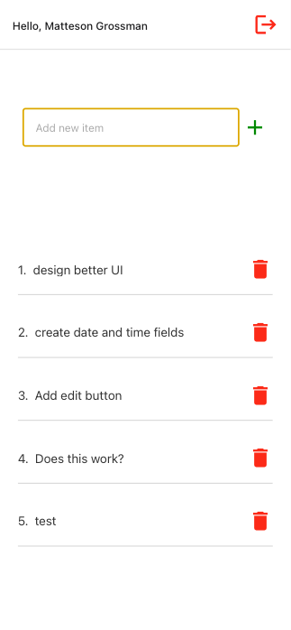

# RNR-Firebase

Massive help and thanks to, https://www.freecodecamp.org/news/react-native-firebase-tutorial/, for help in setting this up.

## This Application

This is a to-do app with built in React-Native + Redux with Firebase

Some Features:
Registration and login
Read and write from Firebase
Persistent Auth

## Getting Started

1. Clone the repository
2. Run yarn install
3. Use one of the following commands to run:
   - yarn ios -- (react-native run-ios) Build the iOS App (requires a MacOS computer).
   - yarn android -- (react-native run-android) Build the Android App.
   - yarn web -- (expo start:web) Run the website in your browser.
